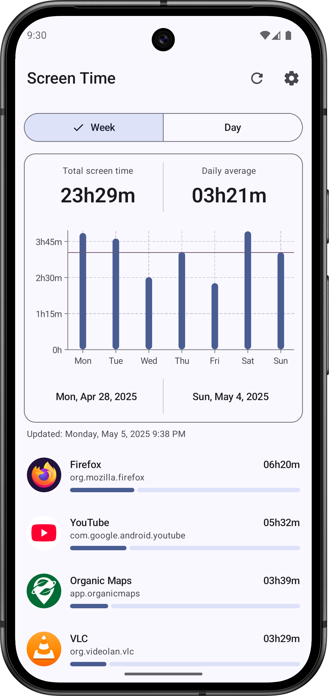
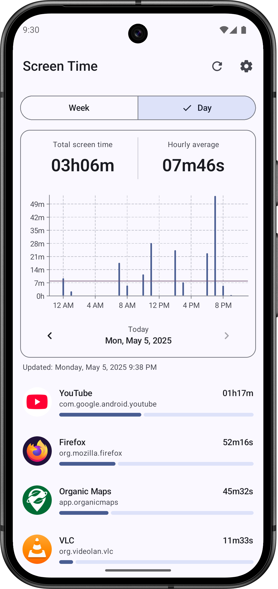
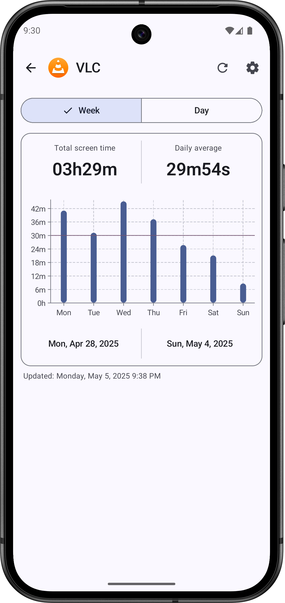
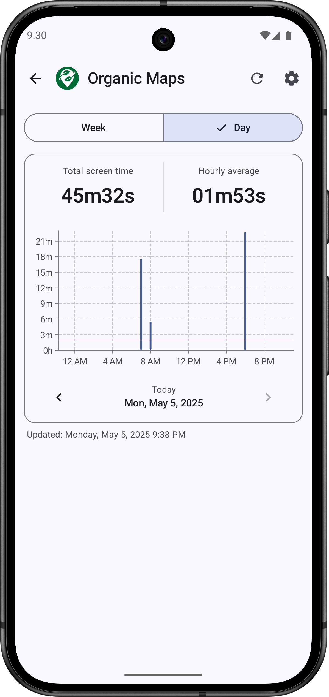
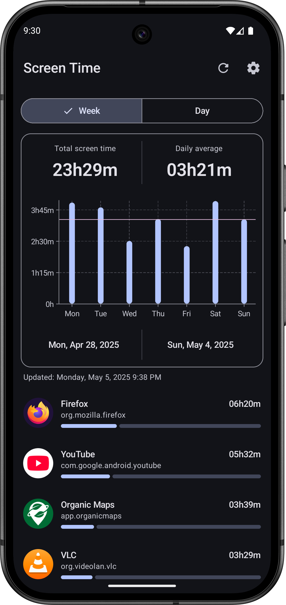
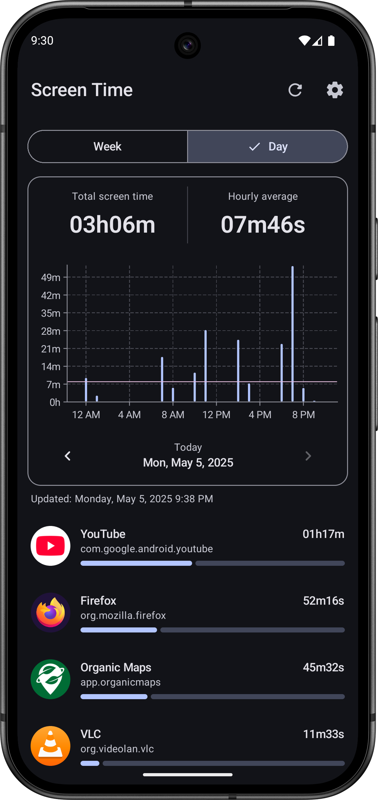
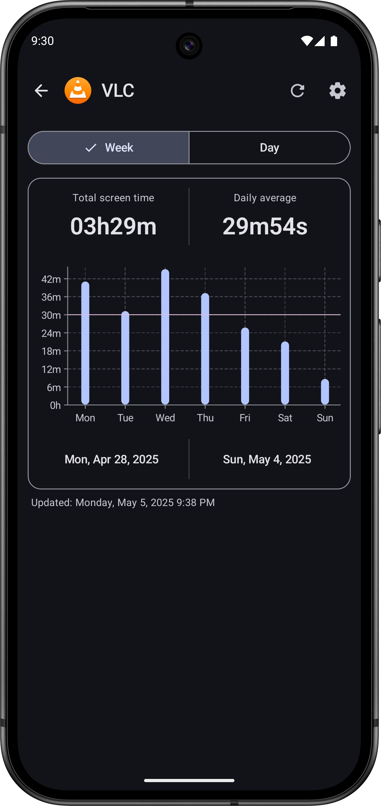
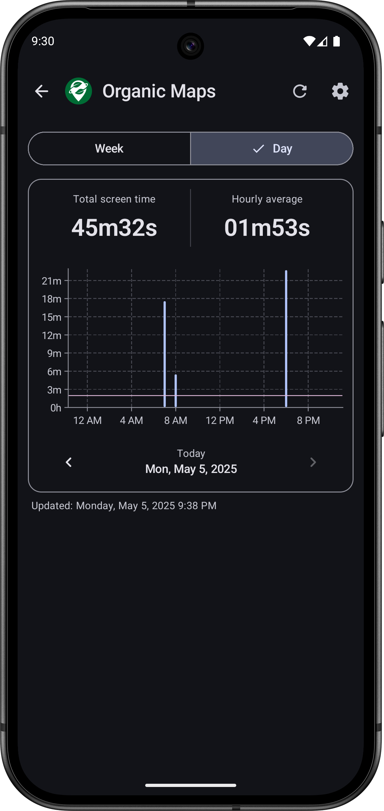

<div align="center"></div>

## <div align="center">Screen Time</div>

<div align="center"><h4>An Android app that allows you to easily track the time you spend on your device and apps.</h4></div>

<div align="center">
    <a href="https://f-droid.org/packages/com.atharok.screentime/" target="_blank"></a>
</div>

You may also download the APK directly from [GitLab](https://gitlab.com/Atharok/ScreenTime/-/releases).

[](https://www.gnu.org/licenses/gpl-3.0)

## Description

Screen Time is a simple app that lets you easily track the time you spend on your device and apps.

Features:

- Displays total screen time for your device over the past week or for a chosen day.
- Comparative graph showing screen time across different days of the week.
- Comparative graph displaying screen time for each hour of the day.
- Ability to view screen time and comparative graphs for each individual app.
- Comparative list of screen time for each app, sorted from the most used to the least used during the chosen period.
- Simple and modern interface.
- Home screen widget.
- No ads.
- No data collection (internet permissions disabled).
- Open source.
- Developed in Kotlin with Jetpack Compose and Material 3.

## Screenshots










## Donate

If you like Screen Time, you can support me via [Liberapay](https://liberapay.com/Atharok/donate) or [Ko-fi](https://ko-fi.com/atharok).

[](https://liberapay.com/Atharok/donate)
[](https://ko-fi.com/atharok)

## Contribution

If you want to translate the app, please submit a merge request on GitLab.
If you have any questions regarding contributions or translations, feel free to open an issue or contact me by [e-mail](mailto:atharok@duck.com).

## Checksums

To verify the authenticity and integrity of the APK, compare its signature against the certificate fingerprints shown below:

```
SHA-256: e6cf1629d462a3686aa4ba2d37e02777257fd0a3bbe5540d8c70f80e12d111cd
SHA-1: 8d66ed4b5d105f7fecce6ebd07dddc569cab29b9
MD5: ea0d7434b89110e49386132bb005bb6b
```

## Licences

The code is licensed under the [GNU General Public License version 3 or later (GPL-3.0-or-later)](https://www.gnu.org/licenses/gpl-3.0).

Dependencies:

- [Core KTX](https://github.com/androidx/androidx) is licensed under [Apache License 2.0](https://www.apache.org/licenses/LICENSE-2.0)
- [Activity Compose](https://github.com/androidx/androidx) is licensed under [Apache License 2.0](https://www.apache.org/licenses/LICENSE-2.0)
- [Compose BOM](https://github.com/androidx/androidx) is licensed under [Apache License 2.0](https://www.apache.org/licenses/LICENSE-2.0)
- [Compose UI](https://github.com/androidx/androidx) is licensed under [Apache License 2.0](https://www.apache.org/licenses/LICENSE-2.0)
- [Compose UI Graphics](https://github.com/androidx/androidx) is licensed under [Apache License 2.0](https://www.apache.org/licenses/LICENSE-2.0)
- [Compose Material 3](https://github.com/androidx/androidx) is licensed under [Apache License 2.0](https://www.apache.org/licenses/LICENSE-2.0)
- [Compose Material Icons Extended](https://github.com/androidx/androidx) is licensed under [Apache License 2.0](https://www.apache.org/licenses/LICENSE-2.0)
- [Lifecycle Runtime Compose](https://github.com/androidx/androidx) is licensed under [Apache License 2.0](https://www.apache.org/licenses/LICENSE-2.0)
- [Navigation Compose](https://github.com/androidx/androidx) is licensed under [Apache License 2.0](https://www.apache.org/licenses/LICENSE-2.0)
- [DataStore Preferences](https://github.com/androidx/androidx) is licensed under [Apache License 2.0](https://www.apache.org/licenses/LICENSE-2.0)
- [Koin AndroidX Compose](https://github.com/InsertKoinIO/koin) is licensed under [Apache License 2.0](https://www.apache.org/licenses/LICENSE-2.0)
- [Vico](https://github.com/patrykandpatrick/vico) is licensed under [Apache License 2.0](https://www.apache.org/licenses/LICENSE-2.0)
- [Kotlin Serialization](https://github.com/Kotlin/kotlinx.serialization) is licensed under [Apache License 2.0](https://www.apache.org/licenses/LICENSE-2.0)
